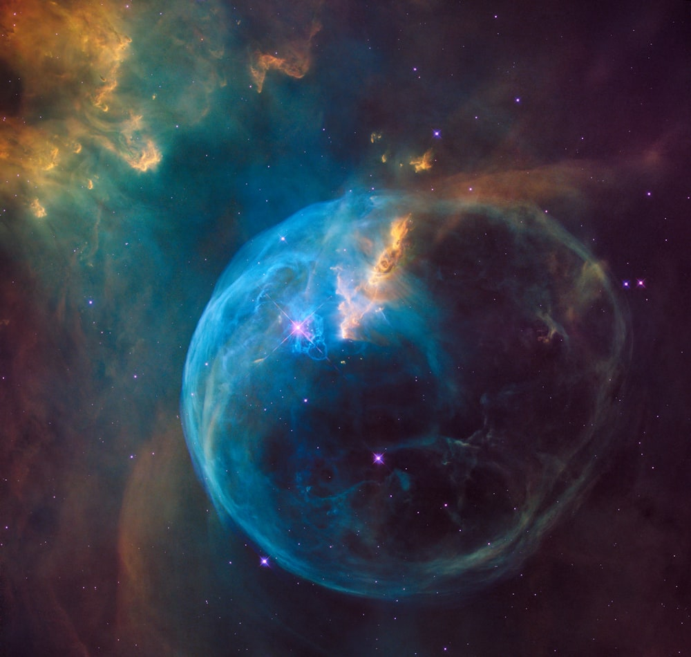
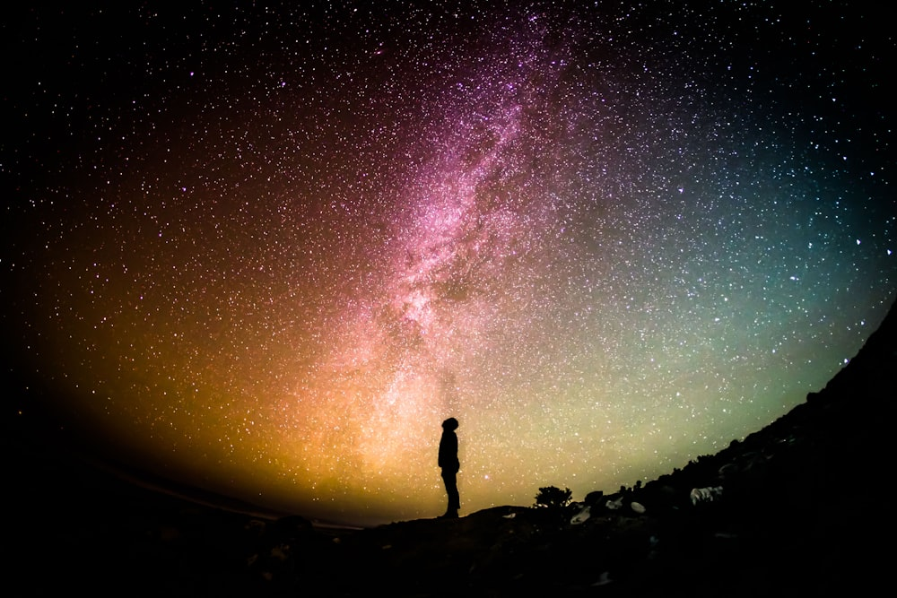

# The Beauty of Nebulas

A nebula is a giant cloud of dust and gas in space. Some come from the gas and dust thrown out by the explosion of a dying star, such as a supernova.

> [!TIP]
> This image is fetched from Unsplash and stored locally in the `space/attachments` folder.

## The Galaxy

We also have a galaxy picture here:

Back to [[index]]
